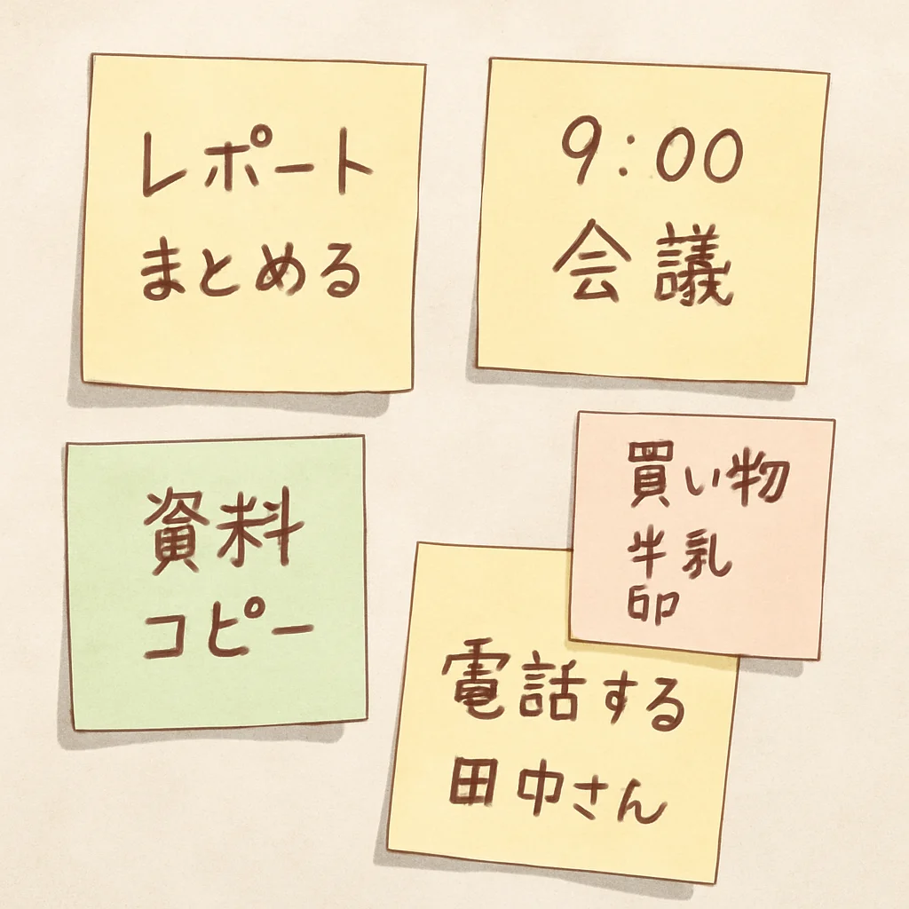

🌙 Mini Notes — современное приложение для заметок

  
 
 <b>Минималистичное и удобное приложение для заметок, созданное на Jetpack Compose.</b>  Быстрое, лёгкое и стильное — всегда под рукой. 

🚀 Функциональность

✔️ Создание и редактирование заметок
✔️ Красивый интерфейс на Material 3
✔️ Локальное хранение данных
✔️ Удобная работа одной рукой
✔️ Темная и светлая тема
✔️ Полностью на Jetpack Compose

🛠️ Технологии
Технология	Использование
Kotlin	основной язык
Jetpack Compose	UI и навигация
Material 3	современный дизайн
MVVM	архитектура
Room	база данных
🖼️ Скриншоты

   

📥 Установка

Скачайте последний APK в разделе:

👉 Releases: (Позже)

📌 Планы по улучшению

Виджеты

Папки / категории

Поиск по заметкам

Синхронизация между устройствами

Cloud backup

👨‍💻 Автор

LagrinDev

🌐 GitHub: https://github.com/lagrindev

✉️ Telegram: https://t.me/devlagrin

⭐ Поддержи проект

Если приложение понравилось — поставь звезду ⭐
Это мотивирует развиваться!
