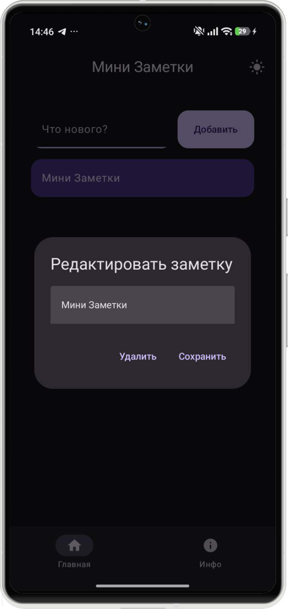
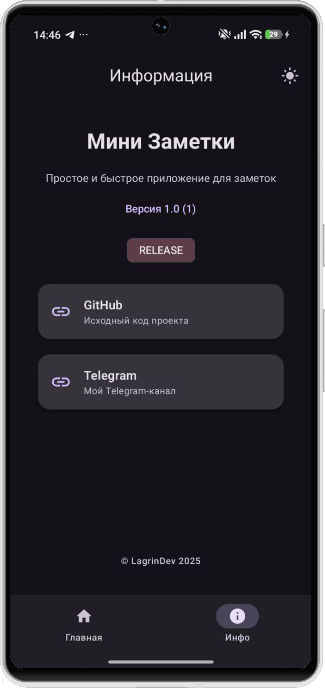

# 📝 Мини Заметки

**Мини Заметки** — современное, быстрое и простое Android-приложение для создания заметок.  
Ничего лишнего: открыл — записал — сохранилось.

## ✨ Возможности
- 📌 Создание заметок
- ✏️ Редактирование и удаление (удержанием по заметке)
- 🌙 Светлая и тёмная тема
- 💾 Локальное хранение (Room)
- 🚀 Быстрое и лёгкое
- 🇷🇺 Полностью на русском языке

## 📱 Скриншоты
| Главный экран | Редактирование | Информация |
|--------------|---------------|------------|
|  |  |  |


# ✉️ Группа 
Telegram: https://t.me/devlagrin

## 🛠 Используемые технологии
- Kotlin
- Jetpack Compose (Material 3)
- Room Database
- MVVM
- Coroutines & Flow

## 📦 Установка
Склонировать проект:
```bash
git clone https://github.com/lagrindev/mininote.git